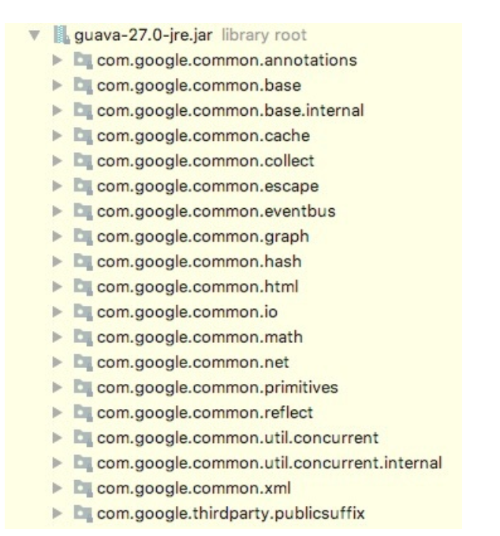

### 学习和发现通用功能模块
1. google_guaua 通用模块介绍
  
2. 如何去发现
  + 将`非业务功能`从业务逻辑找中剥离出来，进行抽象，开发成`类库`、`框架`、 `组件` 
  + 复用、与业务无关
3. 如何去开发
  + 产品意识
  + 服务意识
  + 代码质量意识
  + 不用重复造轮子

### google_guaua 包含的设计模式
1. build 模式
  + 适合创建复杂的对象，分步构建对象的各个部分
  + 构造函数参数列表过多，构造函数种类过多
    + 建造者模式
    + 无参默认构造 + set方法

2. wrapper_pattern：重写原始类的功能+前后加上额外的功能
  + 装饰者模式
  + 适配器模式
  + 代理模式
3. 享元模式
4. immutable 模式==》多线程设计模式
  + 普通不变：对象中包含的引用对象可以改变
  + 深度不变模式
    + 应用：不变类：所有参数通过构造函数设置好，无set方法

### google_guaua 
  + application: 集合操作：遍历、过滤、转换、分组