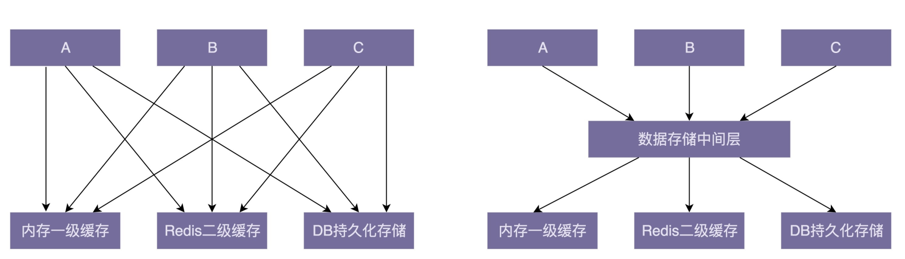

### 解耦
#### 怎么判断是否需要解耦
  + 画出类之间的关系图，然后看它是否复杂
#### 怎么解耦
1. 封装与抽象
2. 中间层
  
3. 模块化：API通信或者其他进程间通信的手段
4. 其他设计思想和原则
  + 设计原则
    + 单一职责原则
    + 迪米特法则
  + 多用组合少用继承
  + 基于接而非实现编程
  + 依赖注入
5. 其他设计模式
  + 观察者模式