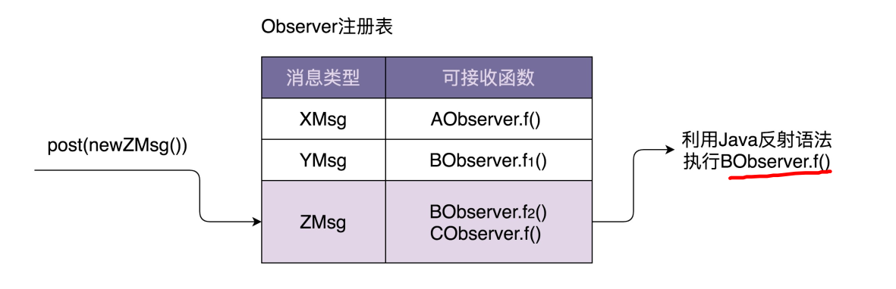

### 观察者模式
1. 应用场景
  + 一个对象的状态发生改变时，所有依赖它的对象都得到通知
2. 解决方案
  + 实现原理
    + 消息：接口类、具体类
    + 订阅者：接口类、具体类
    + 发布者
3. 用到的编程思想
4. 类或对象之间的交互方式 
5. 存在的问题
  + 同步阻塞:客户端阻塞，注册和消息处理耦合在一起==》异步非阻塞
    + 多线程：线程创建、销毁比较耗时，并发无法控制
    + 线程池：
  + 不能跨进程
  + 被观察者和观察者偶合在一起：通过中间层(消息队列)解耦
6. EventBus==>异步非阻塞框架
  + 代码复用
  + 解耦业务与非业务代码，专注于业务开发
  + 隐藏实现细节
  + 减低开发难度
7. EventBus 
  + 特点
    + 支持异步非阻塞模式
    + 同步阻塞模式
  + 实现原理
    + 任何对象都可以注册到EventBus
    + *通过注解来表明类中哪个函数可以接收被接受者的发送的哪种类型的消息==> 生成注册表
      + 