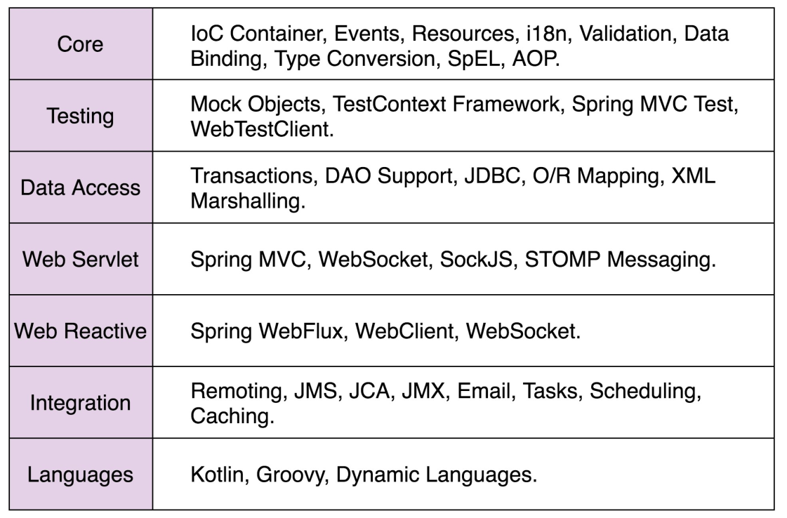
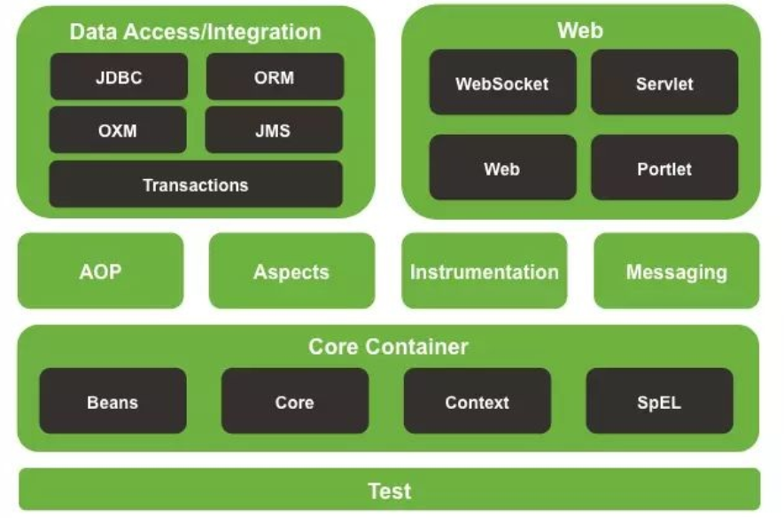

### spingboot 代码框架
  
+ 设计思想或原则
  + 约定大于配置
    + @注解
    + 类名和表名一致
  + 低侵入松耦合:业务代码和非业务代码解耦；规范化、标准化业务开发，降低学习成本和维护成本
  + 模块化、轻量级
  + 再封装、再抽象
  
+ 支持扩展的设计模式
  + 观察者模式、模板模式、职责链模式、策略模式
+ 其他的设计模式
  + 结构型设计模式：
    + 策略模式：根据环境变量、状态值、计算结构动态的选择哪种策略
