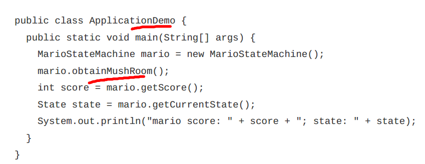

### 状态模式
    1. if/else 或者switch/case过多
1. 类的设计
  * 功能列出来，分类设计
2. servicel类--业务层
3. test类
### 有限状态机
  1. state
  2. event
  3. action
#### 实现方式
1. 分支判断法：代码可读性/可维护性变差
2. 查表法：
  * 配置文件动态生成这个表
  * 缺点，无法支持负责的动作类型
#### 如何解耦
  * 实现思路：状态转移和动作解耦，拆分在不定的类中
1. 目标：
  + 任何状态在可在事件下发生状态状态转移并执行相关的操作
2. 实现方式：
  + event作为抽象接口
  + 各状态分别继承该接口
3. 知识点：
  + 接口继承+多态
  + 原地构造对象+ 设值注入
4. 测试入口
  + 