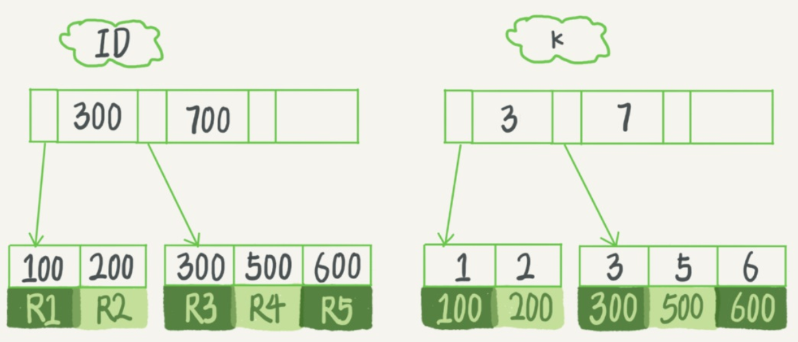

### 索引模型
1. 哈希表：不适合区间查找
2. 有序数组：查找方便，但是更新成本过高
3. N+树:平衡N+树
### InnoDB 的索引模型
+ 索引组织表
  
  + 特点：根据主键顺序以索引的形式存放的
  + 主键索引：数据存在叶子结点中
  + 字段索引：叶子结点中存放的是主键字段的值
+ 索引性能优化手段
  + 覆盖索引：减少索引次数，提升查询性能
+ 最左前缀原则+ 联合索引+ 索引最小空间原则
+ 索引下推
