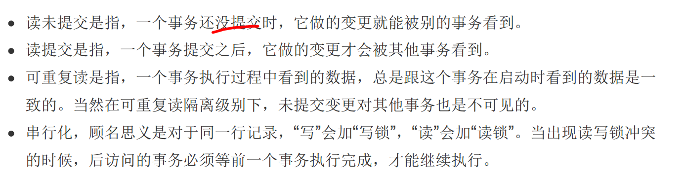
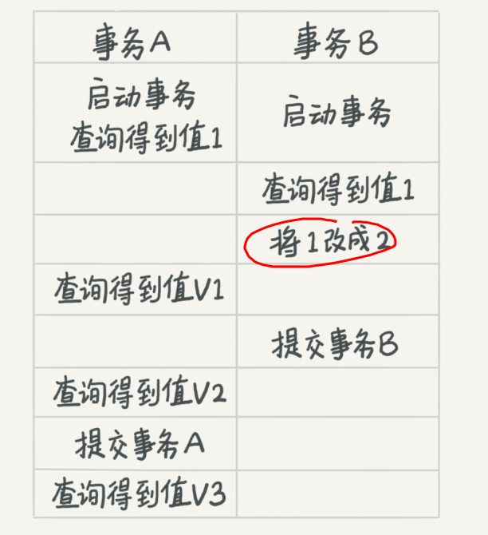

### mysql_transaction
+ transaction：数据库一组操作，要么全部成功,要么全部失败
+ ACID：Atomicity,Consistency,Isolation,Durability
+ 事务的四大特性:原子性、一致性、隔离性和持久性
+ Isolation:
  + read uncommitted
  + read committed
  + repeatable read
  + serializable
  
+ examlpe
  
  