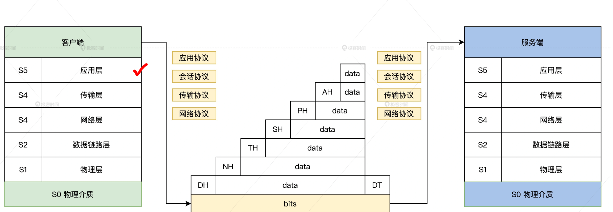

### url到网卡的数据流动
  + 网络协议栈对应用数据的处理过程
    + 网卡将而二进制数据转化为电信号发送出去

### 网络数据包在内核中如何流转
  +* 需求==》软件设计思想
  + 目的：满足网络收发需求
    + 
    + 
### lwip 开源网络实践

### 互联网架构演进过程
### 套接字在linux中的实现
### 协程与网络编程
### io多路复用
  + 多路网络请求怎么处理
  + 复用：一个或多个线程
  + 什么是io多路复用
  + 能解决什么问题
    + 用一个线程处理多个请求，用更少的资源做更多的事情
  + 目前有哪些成熟的io多路复用方案
    + 阻塞io、费阻塞io
    + io多路复用
    + 信号驱动io
    + 异步io
  + 之间的优缺点
### 并发与协程
  + 参考链接：
    + 知乎1：https://www.zhihu.com/people/zhang-cheng-yu-37
    + 知乎2：https://zhuanlan.zhihu.com/p/652275703
    + csdn: https://blog.csdn.net/qq_42956653/article/details/125823947
    + https://www.zhihuclub.com/97290.shtml
    + https://blog.csdn.net/Squid87/article/details/123452472
    + https://zhuanlan.zhihu.com/p/115220699
    +* https://zhuanlan.zhihu.com/p/371811129
  + 技术背景
    + 单机要实现1千万的并发
      + 多线程(线程池)同步问题
      + Nginx:基于事件驱动的异步网络模型
      + C10k:"一个线程对应多个客户端，使用非阻塞IO"和就绪时通知机制"
        + 优点：充分利用CPU、性能较高，但是基于回调处理，逻辑代码过于分散、代码开发效率不高且不容易读懂
      + 解决方案：协程+异步IO
  + 疑问的点：
    + 上下文怎么切换
      + 上下文有哪些东西
      + 怎么出去
      + 怎么回来的
    + 协程的特点：
      + 可暂停和恢复
      + 轻量级线程
      + 用户态线程：少了用户态和内核态之间的切换
      + 一个线程执行
      + 协程可以拥有多个入口,返回多次
    + 多线程相比的优势？
      1. 没有线程切换的开销
      2. 基于`汇编的上下文切换`要比采用系统调用的切换更加高效
      2. 没有锁机制，因为一个线程，不存在同时写变量冲突
      3. 协程因其函数本质，是天然同步的，而在遇到阻塞条件时候，把cpu让给别的协程，等条件满足了再通过中断可恢复的特性再继续运行，就实现了并发
      4. 天然同步和并发性
    + 协程切换(函数调用)需要干些啥？==》达到函数之间的相互调用的结果
      + 协程栈
    + 协程调度：用户态调度
  + 实现原理
    + 用到的知识点
  + 具体的效果怎么样：实践
  + 协程池
    
  + https://zhuanlan.zhihu.com/p/146687131
### apollo架构视频学习

