### 程序加载到计算器运行
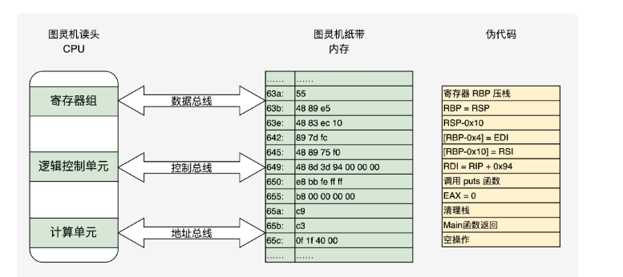
### 计算器硬件
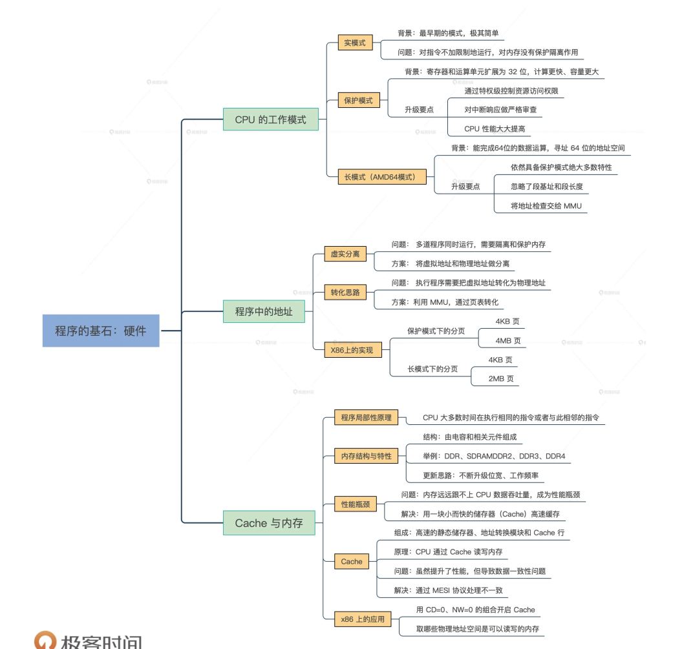
### 计算机资源
## 虚拟内存
1. 连接器：二进制程序==》静态内存空间布局
2. 虚拟内存==》物理内存 ：MMU
### MMU
1. 分页模型
  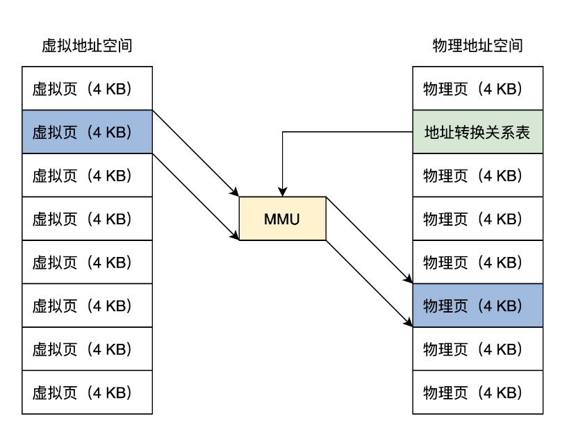
2. 页表：地址转换关系表
  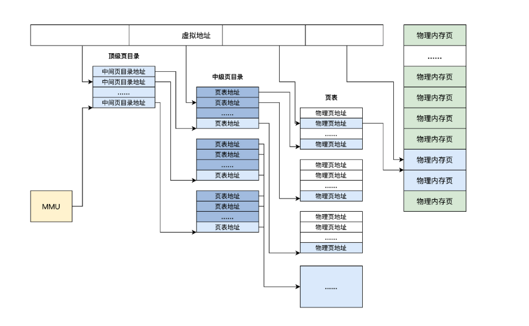

## cache 
1. 背景：
 + cpu 和内存对数据的吞吐量不一致
 + 程序局部性原理
3. 缓存一致性问题

## 数据同步
1. 原子变量：拿下单体变量
2. 中段控制：搞定复杂变量：代码段，有点类似于协程
  1. 中断处理的开始时：先关闭中断==》中断处理完成后打开中断
3. 多核如何做同步
  1. spinlock
  2. fault：busy-waiting，也就是CPU不断的进行检测操作，而无法处理其他任务
  * 原始自旋锁
  * 排队自旋锁： 按照访问顺序上锁
4. 信号量：
  1. 单直信号量、多值信号量
    * 申请失败时进程休眠
    * 资源计数器使用
  2. 等待、互斥，唤醒
5 读写锁:共享独占锁(shared-exclusive)
  1. 应用：读取数据的频率远大于修改数据频率的情形
  2. 特点：
    * 当共享数据有读锁的时候，读取加锁操作都可以完成，写入加锁不能满足
    * 当共享数据有写锁的时候，其他线程不能写入到数据，也不能读数据
    * 读写相互竞争时，写先获取锁
  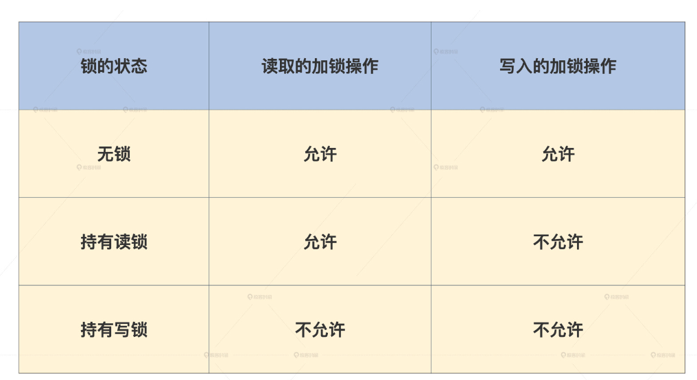
## 总结
  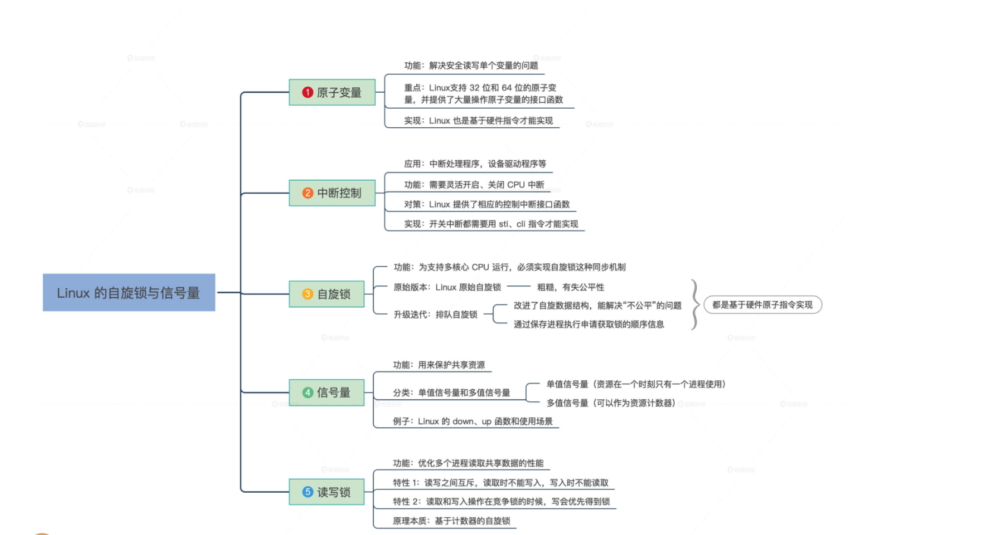
## 内存
   1. 国家的角度：内存就像土地
    * 内存划分：
      * 分段/分页
        * 内存碎片
        * 内存和硬盘的交换速度
    * 内存页：内存的丈量
    * 内存的组织：内存的管理   
1. `内存页`的划分
  * 内存空间地址描述符：msadec_t
2. `内存区`的划分:memarea
  * 硬件区：非虚拟地址，直接与内存打交道的硬件设备，如 DMA
  * 内核区(内核态):虚拟地址空间，各种外设，如显卡，键盘，打印机
  * 应用区(用户态)：虚拟地址,给一用户态程序使用
  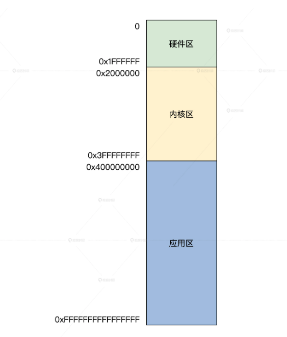
3. 内存去的表示
3. `内存页`的组织
  * 内存结构体数组==>结构体链表
  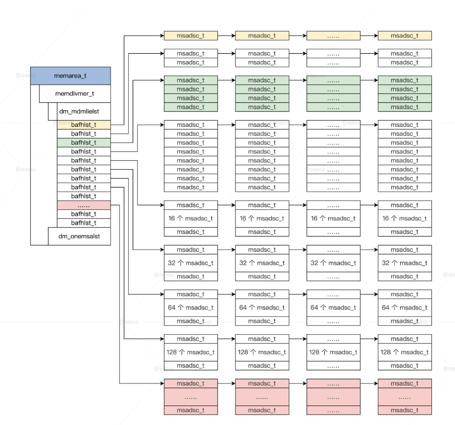
  * 为什么要这么分？
4. 内存初始化
  * 内存页初始化、内存区初始化
  * 内存页和内存区怎么关联：msadec_t如何挂载到内存区对应的数组中去？
    * 确定内存页属于哪个内存区
    * 合并连续的内存页
    * 找到bafhlst的索引：1<<2^index
    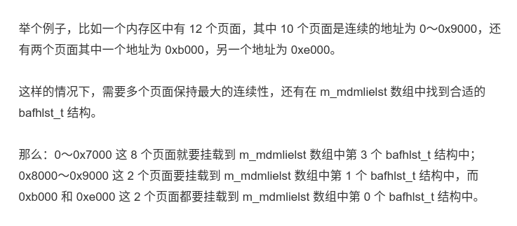
5. 任务条列==》组合==》代码结构
## 内存管理
1. 内存的分配
  * 接口函数==》框架函数==》核心函数
  * 返回内存页的地址
    * 内核、驱动、应用程序对内存页大小、是否连续，所处物理地址都有要求
    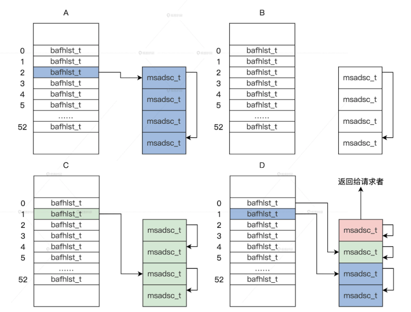
2. 内存的释放
  * 合并内存页到合适的位置
  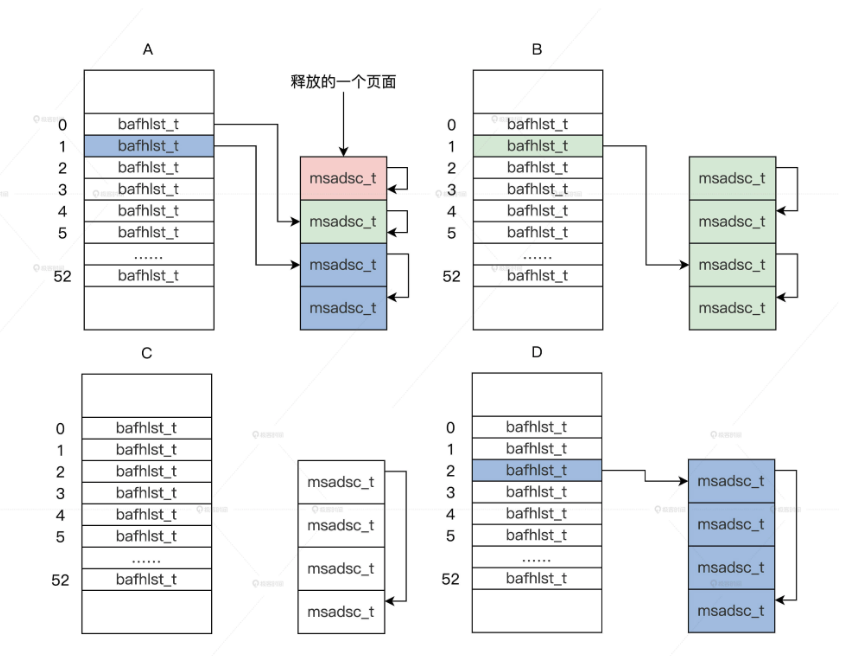
  * 连续、释放 
    * 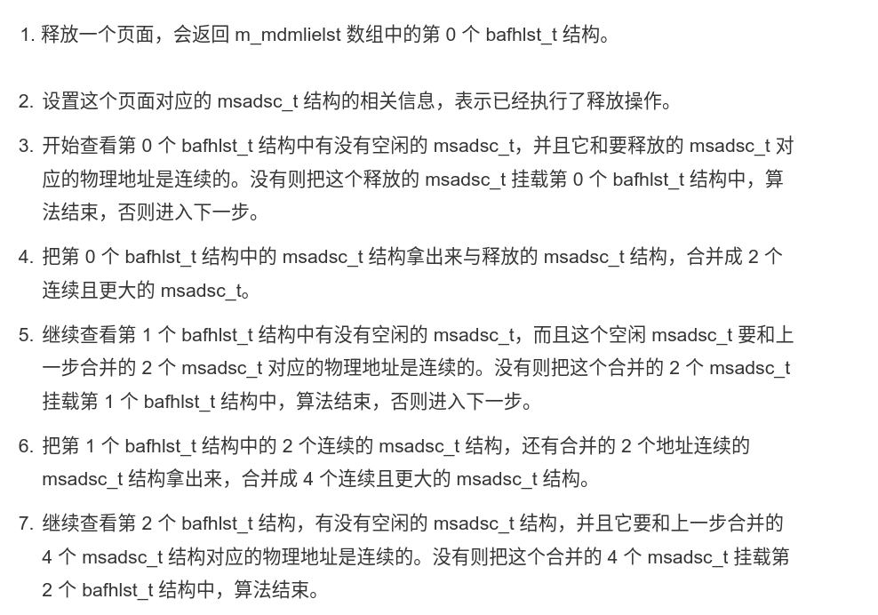
3. 小于页面大小的内存大小(4k)分配？
  1. 基本数据结构 
    * 内存对象：freobjh_t
    * 内存对象容器:kmsob_t
    * 内存对象容器扩展内存 kmbext_t(对象容器内存不够了):msadec_t
    * 管理内存对象容器:kmsobmgrhed_t(物理内存页面)：
  2. 内存对象的分配
  3. 内存对象的释放
  4. 内存对象的销毁
    1. 扩展空间的物理内存页面
    2. 内存对象容器的物理内存页面
  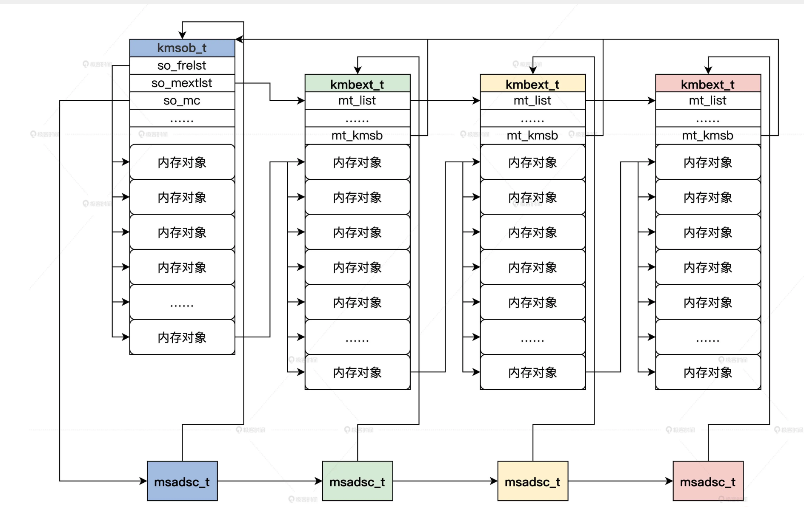
4. 虚拟内存的划分
5. 虚拟内存的管理
6. linux 内存管理:slab 算法

## 虚拟内存
  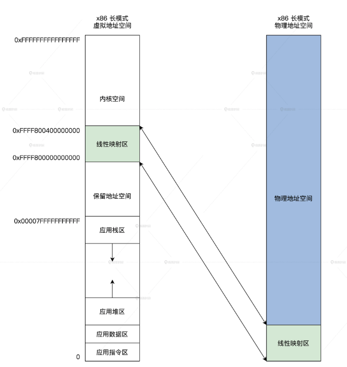
  1. 虚拟内存区间:kmvardsc_t
  2. 虚拟内存空间virmemadrs_t
    + 虚拟地址空间：内核区间(线性映射区)
    + 保留虚拟地址空间
    + 虚拟地址空间：应用(栈区、堆区、数据区、指令去)
    + 页面盒子：映射到内存物理区
    + 页面盒子头：管理页面盒子
  3. 进程的地址空间:mmadrsdec_t
    1. 虚拟地址空间作用与应用程序
    2. 映射信息
    3. 指令区、数据区
    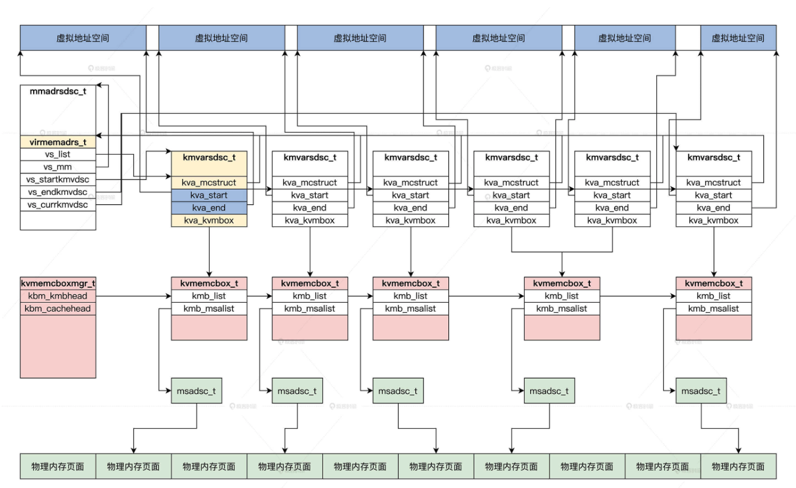
## 虚拟内存管理和释放
   + 虚拟内存空间的分配
   + 释放
   + 映射
    + `延迟分配`技术：缺页异常，在异常处理中分配物理内存页,建立MMU页表映射关系
## linux 分配系统
  1. 伙伴系统
  2. Slab分配器
## 进程
  1.进程的概念：
  + 操作系统实现角度：进程是一堆数据结构
  + 功能：应用程序运行时所需要`资源的容器`
  + 内存管理组件的角度：操作系统是给应用程序提供服务的
  + 内存地址空间：内核内存空间、用户态内存空间
  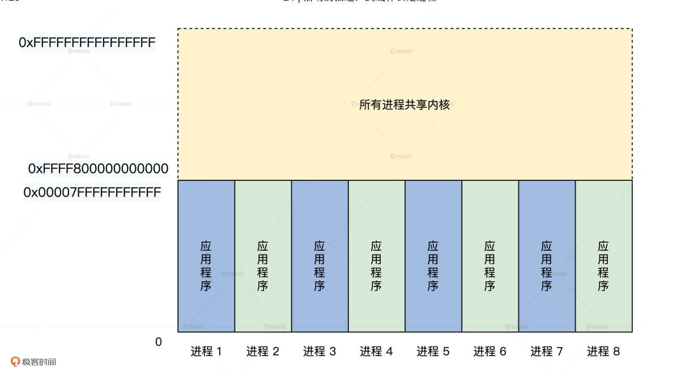
  2. 内核与应用程序的关系
    + 应用程序需要内核提供资源:1.停止应用程序 2. 进入内核空间执行内核代码 3. 返回结果，`资源描述符`
    + 内核需要控制程序的执行：随时中断(`进入内核地址空间`)或者恢复执行
      * 程序程序机器上下文、运行时刻的堆栈数据
  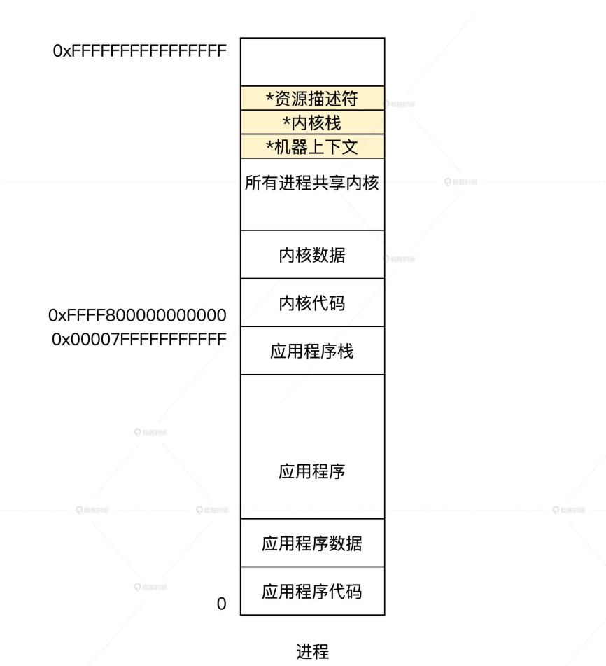
  3. 进程数据结构
   + 机器上下文
   + 资源描述符
   + 内核栈初始化：内核栈内存地址空间放一份CPU寄存器代码
      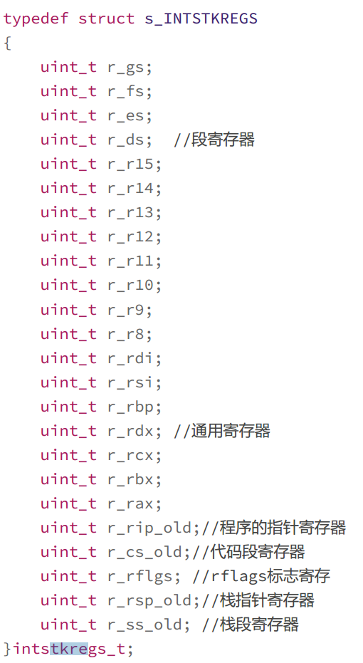
   + 进程内存地址空间
  4. 内核进程、普通进程
### 进程管理
  + 进程状态
    * 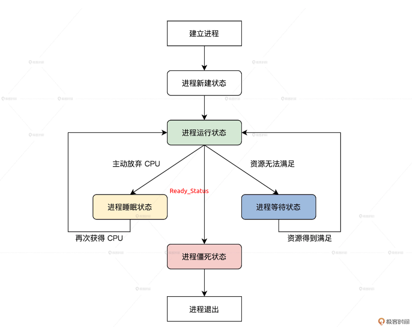
  + 数据结构
    + 进程数据结构 thrdlst_t 
    + 调度数据结构：schdata_t
    + 调度管理结构(多核) schedclass_t
    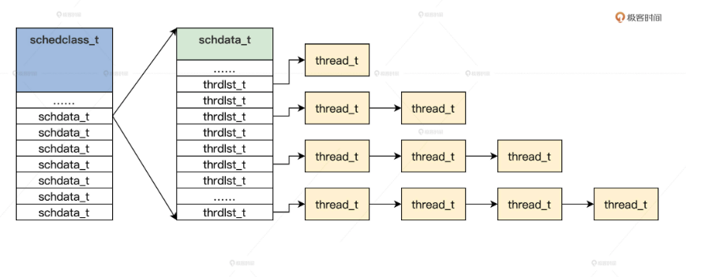
  + 进程调度:优先级队列
    1. 获取当前进程地址
    2. 获取下一层进程地址
    3. 如何切换：进程在内核中的函数调用路径
      + 内核栈保存进程函数调用路径
      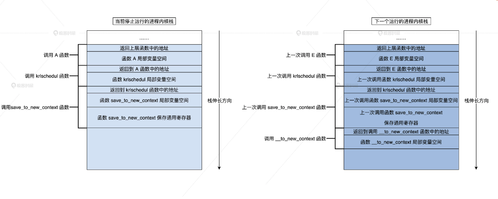
    4. 空转进程：没有进程时避免进入os进入死机
  + 进程的等待与唤醒
   + 进入等待：设置进程为等待状态==》从调度器链表中脱离==》加入进程等待队列
   + 唤醒:从等待进程队列中获取进程==》设置进程的状态==》加入进程调度器队列中
  + linux 进程和进程调度
  + 进程数据结构：task_struct
  + 进程调度算法：
    + 优先级调度算法
    + 实时调度算法
    + 完全公平调度算法(CFQ)
  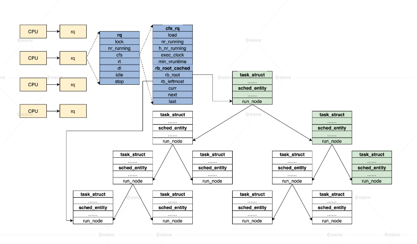

### 设备io
  + 设备:设备是一种资源，os有效管理设备，以便给应用程序提供服务操作，通过总线与CPU相连
  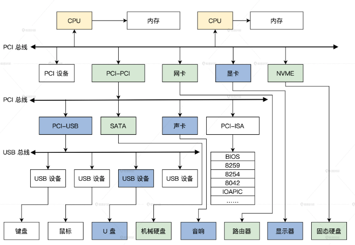
    + 数据结构
      + devid_t,device_t
      + driver_t
    + 管理设备：分权治之，设备控制代码虚拟出来的网卡
    + 设备驱动
      + 设备表：管理各类设备和设备驱动程序
        + devlst_t(结构体数组),devtable_t
      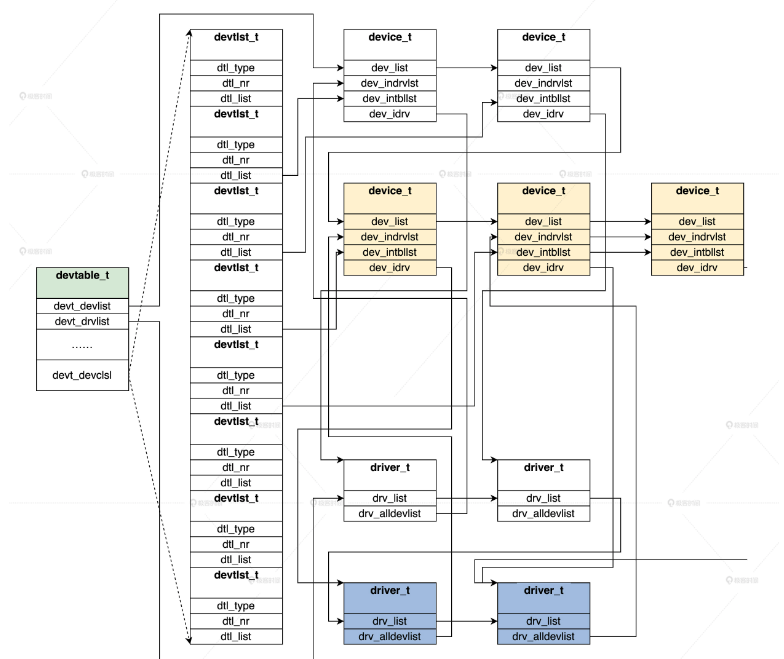
      + 驱动程序的功能：12个功能
      + 驱动程序表：内核与驱动程序的功能联系在一起：driver_t 里面的函数指针数组
  + 注册设备
  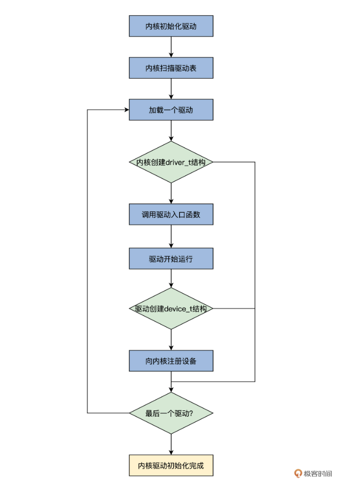
    + 过程：1.内核加载运行设备驱动程序==》2. 调用内核接口建立设备==》3.向内核注册设备和驱动
    + 驱动入口函数：驱动模型：
      1. 驱动与设备握手
      2. 内核注册设备：device_t 加入到设备表中
      3. 安装中断回调函数：CPU接收到中断信号后==>中断处理框架函数==》调用设备驱动程序提供的中断回调函数
      4. 驱动加入内核：dviver_t 实例变量挂载到设备表中
  + 使用设备
    + i/o包：参数管理方法，驱动功能函数的参数集合==》数据结构
    + I/0 的创建和删除
    + 向设备发送IO包
      + 发送IO 包
      + 调用设备驱动
    + 设备驱动程序实例：实现驱动函数的相关功能
      + 初始化：配置设备和驱动
### 文件系统
  + 文件系统架构
  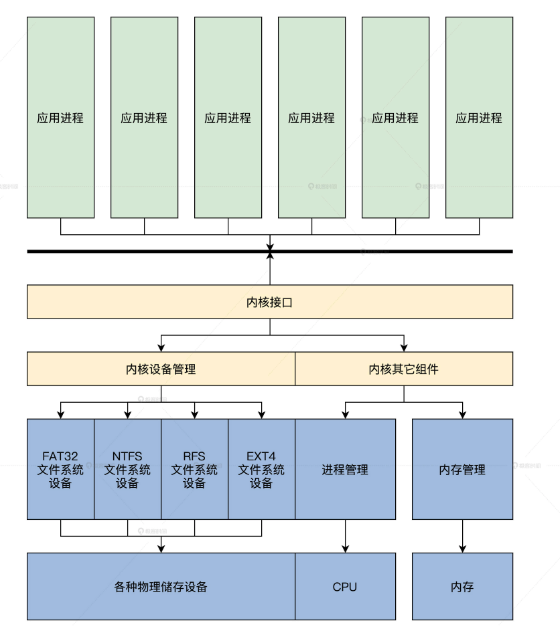
  + os 如何管理各种格式的文件的？
   + `文件系统设备驱动程序`
  + 逻辑文件块和真实物理文件块对应起来？一对多
  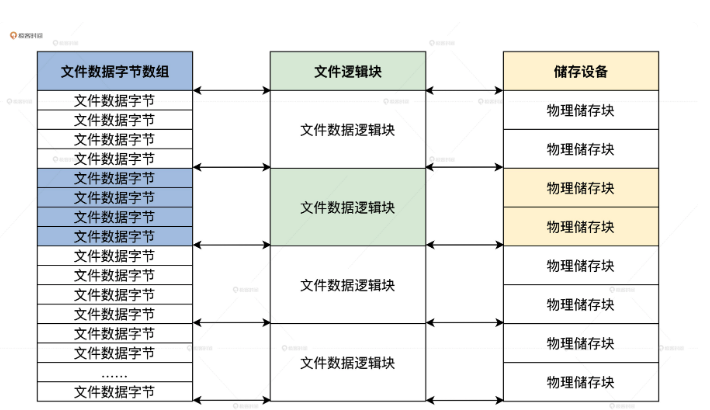
  + 如何管理各种各样的文件==》目录
  + 文件数据逻辑块
  + 文件管理头
  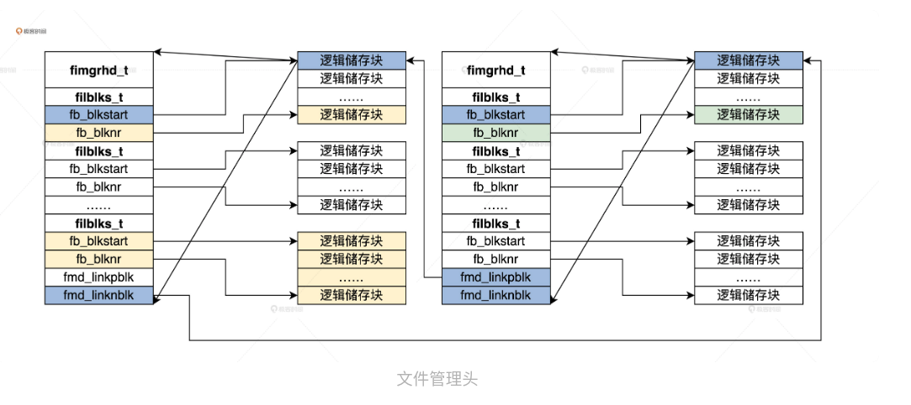
#### 文件系统元数据==》超级快
  + 文件系统数据结构
  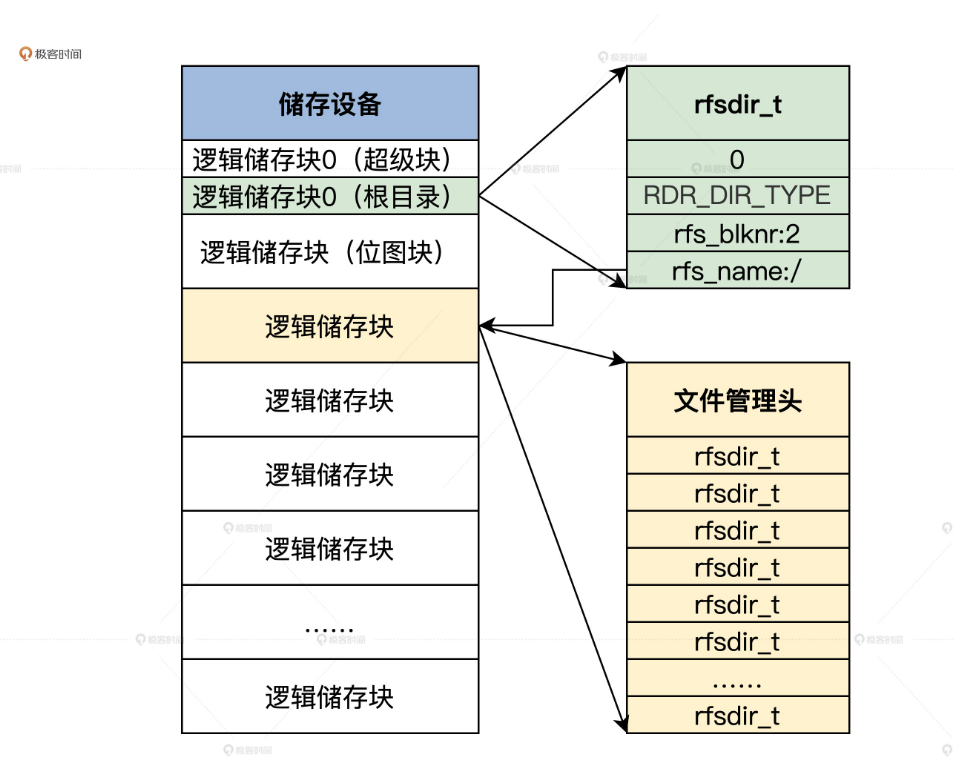
    + 文件系统超级块：文件系统描述块
    + 逻辑存储块状态位图
    + 文件根目录
    + 文件管理头  
  + 文件系统格式化操作
    + 建立超级块
    + 建立位图
    + 建立根目录
    + 串联
  + 文件系统操作
  1. 目前文件对应的rsdir_t结构
  2. 文件管理头
  + 辅助操作
  + 新建/删除
  + 读写/文件
  + 关闭文件
### 网络
### 服务接口API
  + 总体框架
  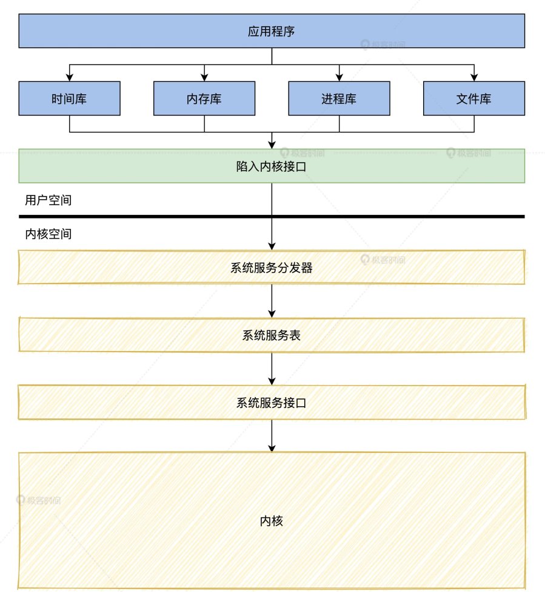
  + 如何进入内核：软中断，command:int255
    1. 允许相应中断的情况下，中断当前正在运行的程序
    2. 切换到CPU RO 特权级，并跳转到`中断门描述符`相应的地址上运行`中断处理代码`(内核代码)
  + 应用程序发送中断：软中断命令 int255
  + 系统服务分发器
  + 系统服务表：函数指针数组
  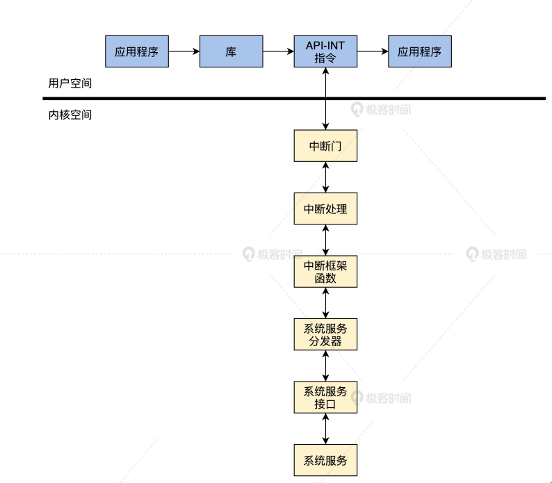

